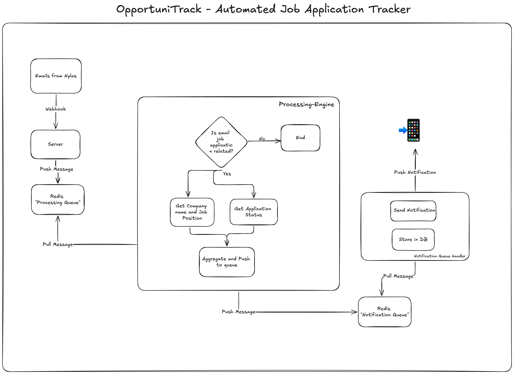

## OpportuniTrack - Track Your Next Opportunity, Effortlessly.

OpportuniTrack is an automated job application tracker using email.

Job hunt is exhausting (especially in this market!), and it's essential to keep track of hundreds of applications you submit everyday.

OpportuniTrack saves hours of manual work of keeping track of job applications everyday by automating it using your email

## Features

-   Track applications automatically by connecting your email
-   Get notified whenever there is an update on your application
-   Add or edit applications manually
-   More features coming soon!

## Architecture

## Note

-   OpportuniTrack is powered by **Nylas API** to securely analyze your emails
-   We only access emails that is likely to be a job application related email (predicted by our Machine Learning Model)
-   We don't store your email in our database, we only extract job application related information and store it
